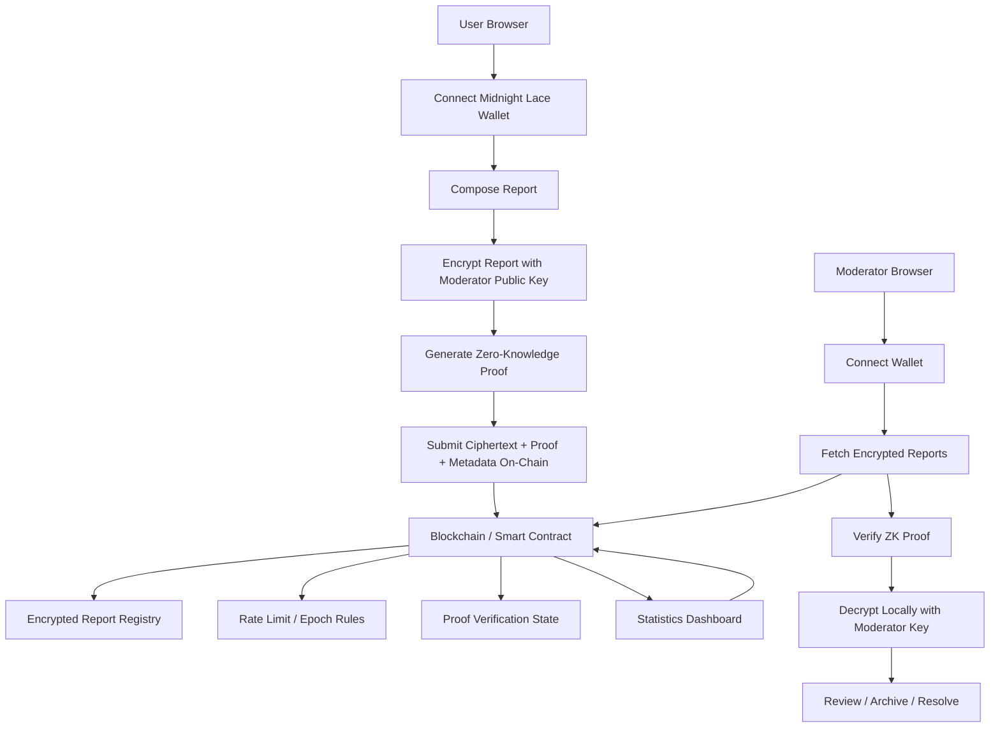

# Proof-Speak: Privacy-Preserving Whistleblower System

A modern, privacy-first whistleblowing platform built using **zero-knowledge proofs (ZKPs)** and **blockchain principles**. This system enables users to submit encrypted reports anonymously while allowing moderators to verify and review them securely.

---

## Project Overview

Proof-Speak is designed to solve a critical problem: **how to report sensitive information without exposing identity**.

It ensures:

* End-to-end encryption
* Anonymous reporting
* Verifiable submissions via ZK proofs
* On-chain integrity without revealing user data

---

## What This Project Does

### User Flow

1. Connect wallet (Midnight Lace)
2. Write a report
3. Encrypt report using moderator's key
4. Generate zero-knowledge proof
5. Submit to blockchain

### Moderator Flow

* Connect wallet
* View encrypted reports
* Verify ZK proofs
* Decrypt reports locally
* Review and manage submissions

---

## Key Features

* **Zero-Knowledge Privacy** → No identity exposure
* **Encrypted Reports** → Only moderators can decrypt
* **Rate Limiting** → Prevents spam
* **On-Chain Metadata** → Immutable & verifiable
* **Local Decryption** → Sensitive data never leaves browser

---

## Architecture Diagram



This architecture keeps sensitive report content private. The blockchain stores only **ciphertext, proof data, and protocol metadata**, while readable report content is reconstructed only inside the moderator's browser after verification.

---

## Why Zero-Knowledge Proofs Matter

Zero-knowledge proofs are the core privacy layer of Proof-Speak.

In a normal reporting system, the platform often needs to trust the server with identity, submission validity, and access rules. In Proof-Speak, **ZK proofs let the system verify that a report is valid without revealing the reporter's identity or private report details**.

### What ZK proofs help prove

* The reporter is allowed to submit
* The submission follows protocol rules
* Rate limits are respected
* The report was generated correctly before being accepted on-chain

### Why this is important

* **Privacy by design**: the chain never sees plaintext identity or report content
* **Less trust in backend systems**: verification happens cryptographically, not just through application logic
* **Stronger integrity**: fake or malformed submissions can be rejected without exposing private data
* **Safer whistleblowing**: users can report sensitive issues with lower risk of retaliation

### In simple words

Proof-Speak uses ZK proofs to answer this question:

> “Can the platform verify this report is legitimate without learning who sent it or what it says?”

The answer is **yes**. That is what makes the system privacy-preserving instead of just encrypted.

---

## Tech Stack

### Frontend

* React / Next.js
* Tailwind CSS

### Blockchain & Privacy

* Zero-Knowledge Proofs (ZKP)
* Smart Contracts (On-chain storage)

### Wallet Integration

* Midnight Lace Wallet

---

## Screenshots

### Landing Page


### Moderator Dashboard


### Anonymous Reporting


### Platform Statistics


---

## How to Run

```bash
# Clone repo
git clone <your-repo-url>
cd proof-speak

# Install dependencies
npm install

# Run app
npm run dev
```

---

## Why This Project Stands Out

* Real-world problem (privacy + reporting)
* Advanced concepts (ZK proofs, blockchain)
* Full-stack system design
* Clean UI + user flow

---

## Future Improvements

* Visual proof verification trace for moderators

* Support for multiple moderator keys / departments

* Better on-chain analytics for submission trends

* Real smart contract deployment notes

* Optional secure off-chain encrypted backup

* Real-time notifications

* Advanced fraud detection (ML integration)

* Multi-role access control

* Scalable backend services

* Real-time notifications

* Advanced fraud detection (ML integration)

* Multi-role access control

* Scalable backend services

---

## Authors

Neha Vivekananda Nayak
Sangram Dighe
---
